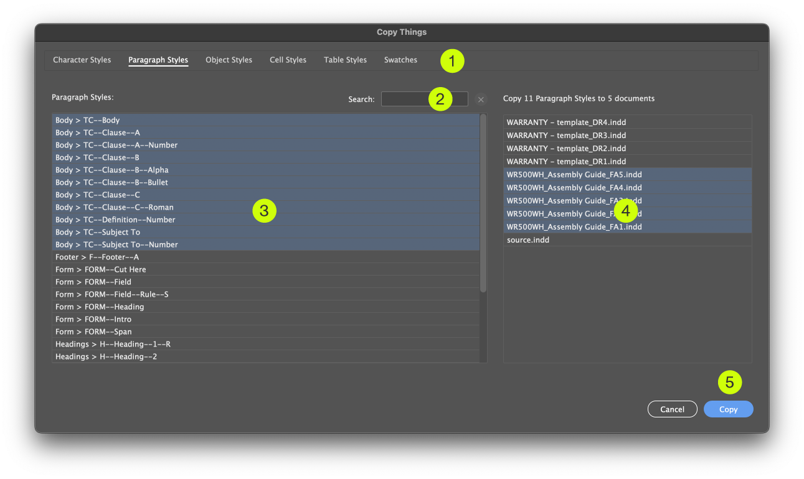
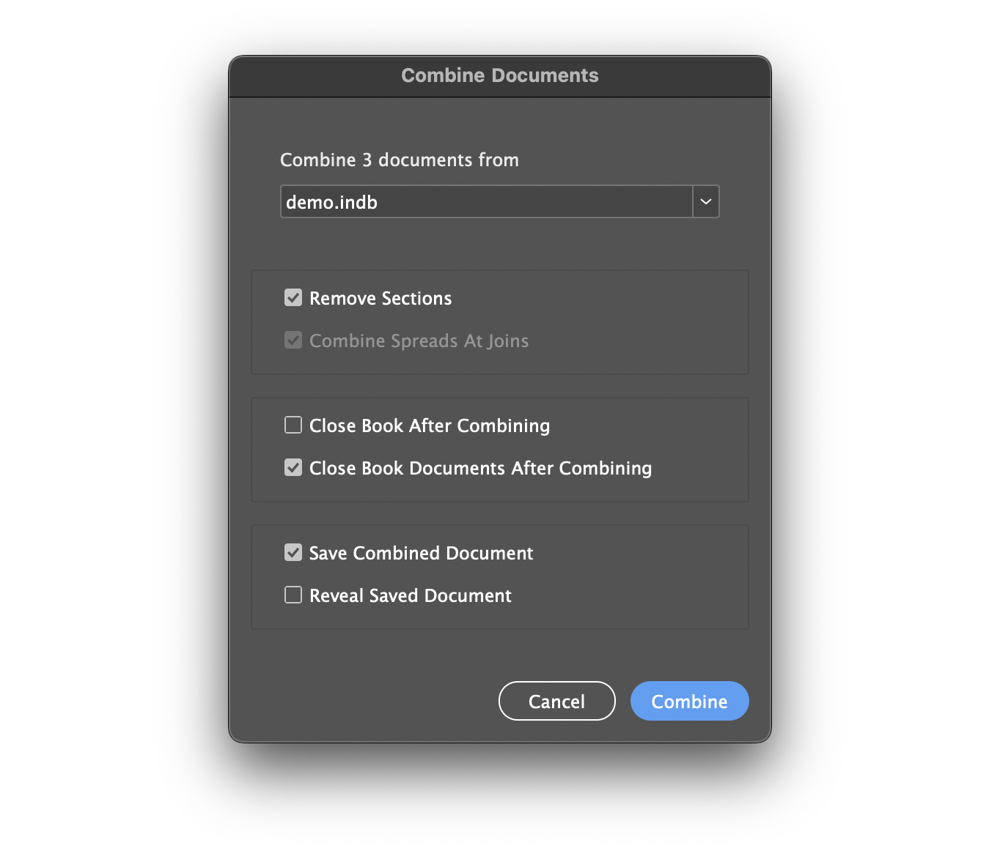
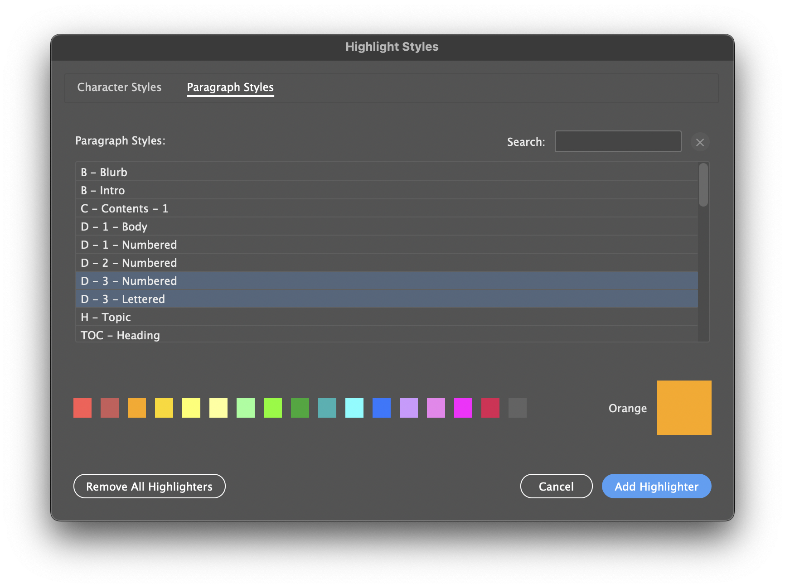

# Scripts for Adobe Indesign

Some scripts I've written to help use Adobe Indesign.

## Contents

1. [Copy Things](#copy-things)
1. [Numbered Markers](#numbered-markers)
1. [Combine Documents](#combine-documents)
1. [Style Highlighter](#style-highlighter)

---

## Copy Things

         

A script for copying/updating styles from one document to one *or more* destination documents.

### Features

- Quickly access and select multiple things to copy in one go.
- Copy to as many documents as you have open in one go.
- Will update existing things, if they already exists.
- Takes account of the hierarchic structure in the source document, and replicates it in the destination (ie. keeps your folder structure intact).

### Usage

1. Choose the thing type: *Character Styles, Paragraph Styles, Object Styles, Cell Styles, TableStyles, Swatches*.
1. Filter the list of things, if it helps.
1. Choose the things to copy.
1. Choose the destination documents (will show all open documents).
1. Press the Copy button to perform the copying.

### Limitations

- Not much testing done! If you find a bug, please [start a new Issue](https://github.com/mark1bean/scripts-for-adobe-indesign/issues) and always include a link to a demo document that shows the error.
- The scripting API doesn't provide control over the *order* of the copied things, so you may need to sort them afterwards.

---

## Numbered Markers

         

A script for managing numbered markers linked to a numbered list. For example: numbered place markers on a map, linked to the list of place names.

Why is it good? It saves you from manually re-numbering all your markers when the list changes order, or when items are removed.

Read the [quick tutorial](docs/numbered-markers-quick-tutorial.md). Or the ultra-quick tutorial.

 You will need:

1. A marker — a text frame **with an object style applied**, eg. a circle text frame with a number in it.
1. A numbered list — paragraphs **with a paragraph style applied**, that *must use Indesign's numbering system*, eg. a list of place names for a map legend.

Run this script, choosing the list paragraph style and the marker object style and make sure that "Create missing markers" is ON.

Result: the script will create as many markers as needed and they will be linked to your list. Now you can position them freely and they will update every time you subsequently run the script.

#### Limitations

- Not much testing done! If you find a bug, please [start a new Issue](https://github.com/mark1bean/scripts-for-adobe-indesign/issues) and always include a link to a demo document that shows the error.
- If you already have markers set up, see the last section of the [quick tutorial](doc/numbered-markers-quick-tutorial.md).

---

## Combine Documents

         

A script for combining multiple documents into one.

#### How to use

1. Add all documents to a **book**, if not already. This is how you will tell the script in which *order* you want to combine the documents. Once the documents are combined, you don't need to keep this book; it is just a stepping stone.
1. Run script and choose the book (if more than one) and set the options you want.
1. Click "Combine"

#### Limitations

- Not much testing done! If you find a bug, please [start a new Issue](https://github.com/mark1bean/scripts-for-adobe-indesign/issues) and always include a link to a demo document that shows the error.

---

## Style Highlighter

         

Highlights all text in a chosen paragraph or character style.

 A non-damaging visual tool to spot where styles have gone astray.

#### How to use

1. Run script to show the UI.
1. Select one (or more) paragraph or character styles.
1. Select a highlight color.
1. Click "Add highlighter".

#### Notes

- The script makes use of **conditions** to perform the highlighting. It shouldn't interfere with existing conditions, because multiple conditions can be applied to the same text without a problem. The script uses a naming prefix to avoid collisions.
- The highlighting is only visible when in normal screen mode, and disappears in preview mode.
- You can leave the highlighting conditions active for as long as you want.
- To remove the highlighting you can either (a) manually remove the Highlighter Style condition from the Conditions Panel, or (b) run the script and choose "Remove all Highlighters" to remove them all.

#### Limitations

- The highlighting operation happens when you press the "Add Highlighter" button; it will not highlight new paragraphs even if they use the highlighted style.
- Not much testing done! If you find a bug, please [start a new Issue](https://github.com/mark1bean/scripts-for-adobe-indesign/issues) and always include a link to a demo document that shows the error.

---

## More scripts coming

I will be sharing more of my scripts when I get time. Click "Watch" to get notified of updates!

---

## Installation

Step 1: Download the individual scripts (see buttons under script names), or
[-*_FREE!_*-F50?style=flat-square)](https://github.com/mark1bean/scripts-for-adobe-indesign/archive/refs/heads/main.zip)

(Note: If the script shows as raw text in the browser, save it to your computer with the extension ".js".)

Step 2: Place the Scripts in the Appropriate Folder

See [How To Install Scripts in Adobe Indesign](https://creativepro.com/how-to-install-scripts-in-indesign).

---

## Author

Created by Mark Bean (Adobe Community Expert "[m1b](https://community.adobe.com/t5/user/viewprofilepage/user-id/13791991)").

If any of these scripts will save you time, please consider supporting me!

---

## License

These scripts are open-source and available under the MIT License. See the [LICENSE](LICENSE) file for details.
