# Numbered Markers Quick Tutorial

Follow along this little story to see what happens.

---

*This is the minimal document set up:*

---

---

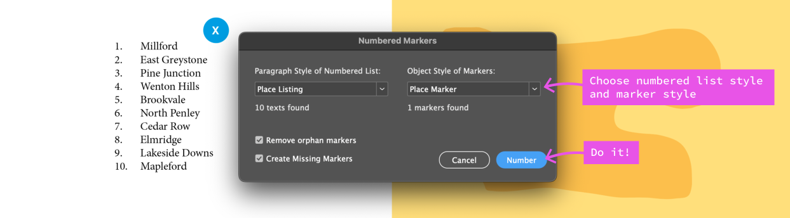

Note: if you already have your document populated with "unmanaged" markers, and you don't want to reposition them, see [But I already have my markers all set up](#but-i-already-have-my-markers-all-set-up).

---

---

---

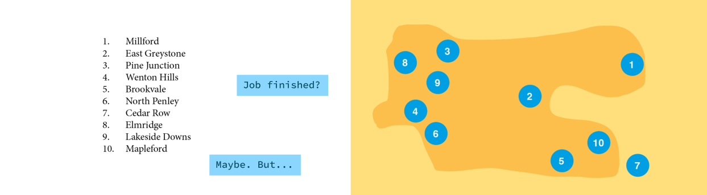

---

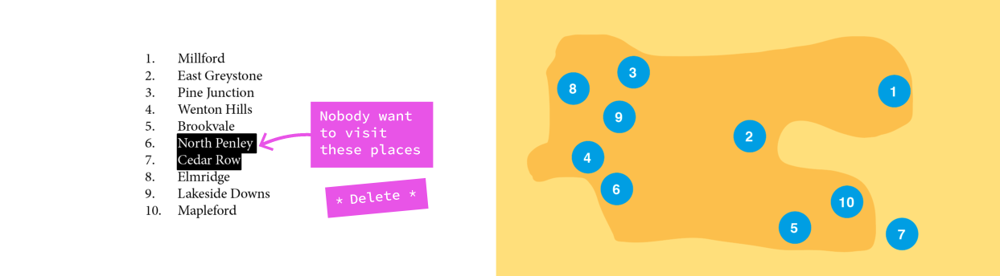

---

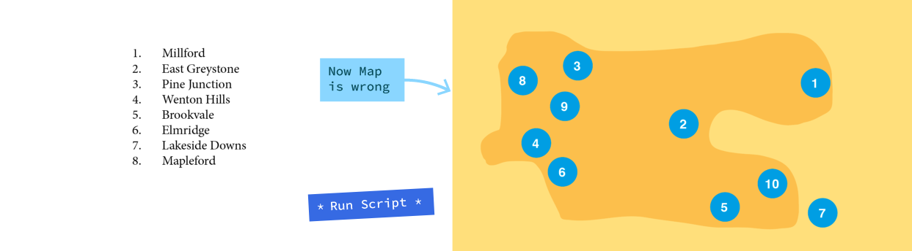

---

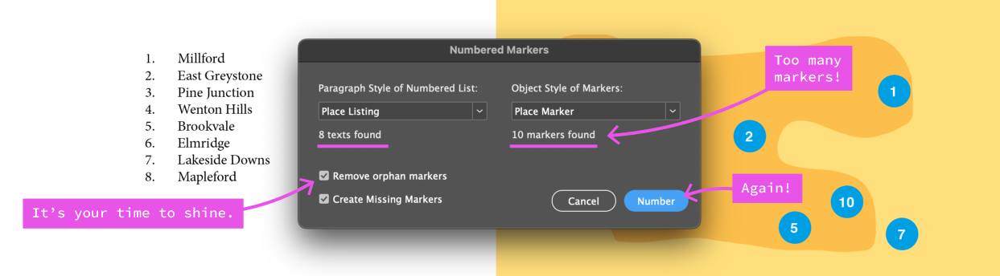

If there are more texts found than markers found, script will create markers for the "unmarkered" texts.

---

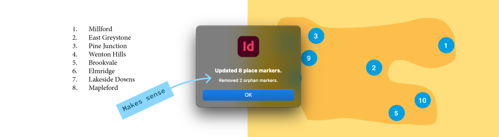

---

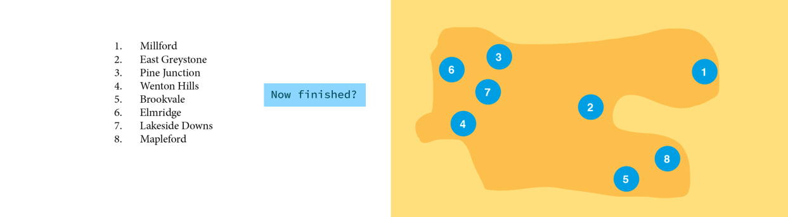

---

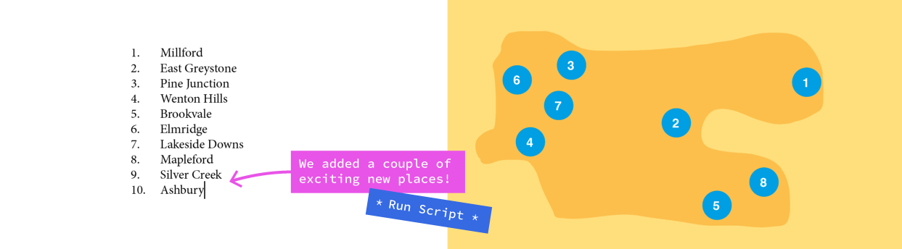

---

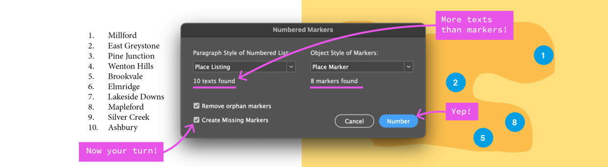

---

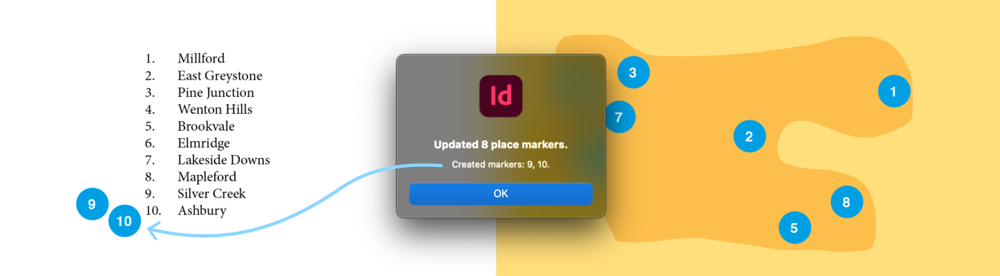

---

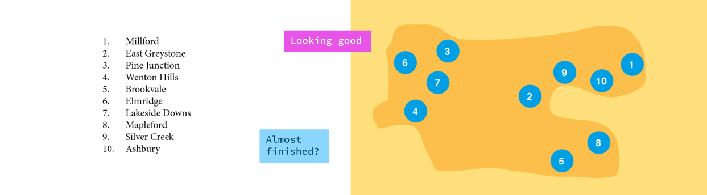

---

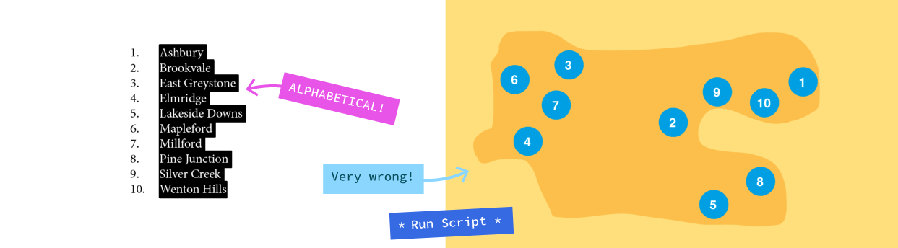

---

---

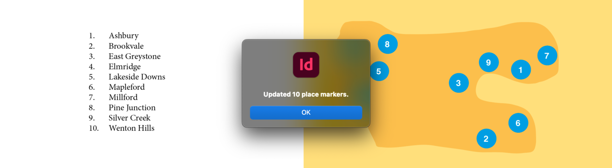

---

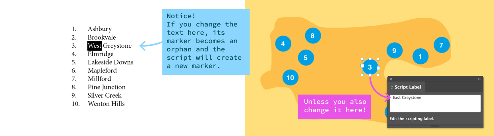

Here you can see how the script links between the numbered text and the marker. You can show the **Script Panel** by choosing menu *Window > Utilities > Script Label*.

---

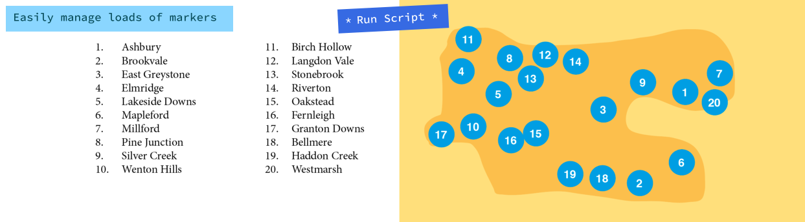

---

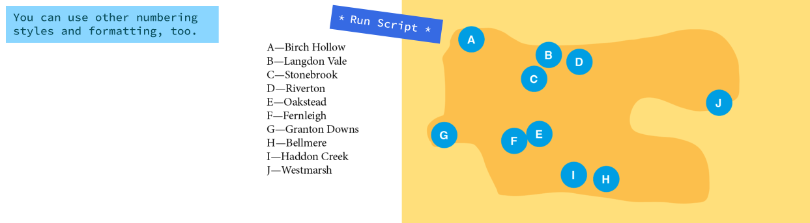

---

## But I already have my markers all set up

The script makes a link between a numbered paragraph and its marker by matching the text of the paragraph to the script label of the marker. It does this automatically whenever it creates a marker, but there's no reason you can't do it manually.

There are two approaches here:

##### (a) Create new markers and reposition them

1. When you first run the script, turn OFF *Remove orphan markers*, but let it create a complete set of new markers.
1. Position the new markers *over the top* of the existing markers (don't bother deleting the old ones, it will happen in the next step).
1. Run the script again, this time with *Remove orphan markers* turned ON. This will remove all the non-linked markers.

##### (b) Link your markers to the texts, using Script Labels

1. Copy the exact text of the list item, eg "Silver Creek".
1. Select the correct marker for "Silver Creek".
1. In the Script Label panel (*Windows > Utilities > Script Label*), paste the text from step 1.
1. Repeat this for each marker.

Once you've done them all, you shouldn't have to do that process again—the script will handle it from then on.

---

## Download Script

         

---

[Go Back](../README.md)
