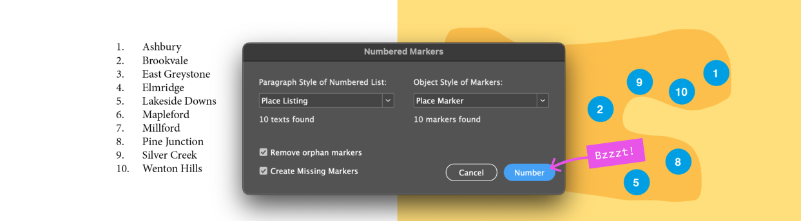

# Numbered Markers Quick Tutorial

Follow along this little story to see what happens.

---

*This is the minimal document set up:*

---

---

Note: if you already have your document populated with "unmanaged" markers, you may want to turn off *Remove orphan markers* this first time, because you might need your unlinked markers to manually replacing with the new linked markers. In most other cases it is best to leave *Remove orphan markers* ON.

---

---

---

---

---

---

If there are more texts found than markers found, script will create markers for the "unmarkered" texts.

---

---

---

---

---

---

---

---

---

---

Here you can see how the script links between the numbered text and the marker. You can show the **Script Panel** by choosing menu *Window > Utilities > Script Label*.

---

---

---

## But I already have my markers all set up

We need a way to link between a paragraph on the numbered list and its marker. This script solves it simply by putting the listing's text into the script label (see Windows > Utilities > Script Label) of the marker. It does this automatically whenever it creates a marker, but there's no reason you can't do it manually.

There are two approaches here:

### Create new markers and reposition them

1. When you first run the script, turn off *Remove orphan markers*, but let it create a complete set of new markers.
1. Turn off the markers

If you already have your markers and you think it will be quicker to link them yourself, rather than create new markers and re-position (and removing the old ones)

---

## Download Script

         

---

[Go Back](../README.md)